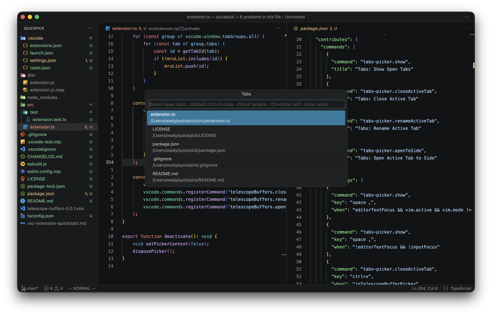

# Telescope Buffers for VS Code

Telescope-like buffer picker for VS Code.

## Features

- **Telescope-like UI:** Instantly search through your open tabs (buffers).
- **Live Preview:** See the file contents in the background as you navigate through the list.
- **Quick Close:** Close tabs directly from the picker without losing focus (default: `Ctrl+X`).
- **Quick Rename:** Rename files without leaving the picker (default: `Ctrl+R`).

## Usage & Shortcuts

Open the picker using the Command Palette (`Tabs: Show Open Tabs`), or use the default hotkeys:

| Action | Default Shortcut | Condition |
| --- | --- | --- |
| **Show Buffers** | `<Space> ,` | Vim Normal Mode or when no editor is focused |
| **Close Tab** | `Ctrl + X` | Inside the Picker |
| **Rename Tab** | `Ctrl + R` | Inside the Picker |
| **Open to Side** | `Ctrl + Enter` | Inside the Picker |
| **Open Tab** | `Enter` | Inside the Picker |

## Remapping Hotkeys

VS Code natively supports remapping these hotkeys. You do not need any special configuration.

1. Open **Keyboard Shortcuts**.
2. Search for `tabspicker`.
3. Double-click the command you want to change:
   - `Tabs: Show Open Tabs` (`tabspicker.show`)
   - `Tabs: Close Active Tab` (`tabspicker.closeActiveTab`)
   - `Tabs: Rename Active Tab` (`tabspicker.renameActiveTab`)
   - `Tabs: Open Active Tab to Side` (`tabspicker.openToSide`)
4. Enter your preferred keybinding.

## Installation

### Method 1 (Recommended)

Go to [Releases](https://github.com/wadyyyyy/Tabs-Picker-for-VSCode/releases) page, download the latest `.vsix` file, manually install in VSCode.

### Method 2: Build from source

1. Clone the repository.
2. Run `npm install`.
3. Package the extension using `vsce package`.
4. Install the generated `.vsix` file in VS Code.

## License

MIT
